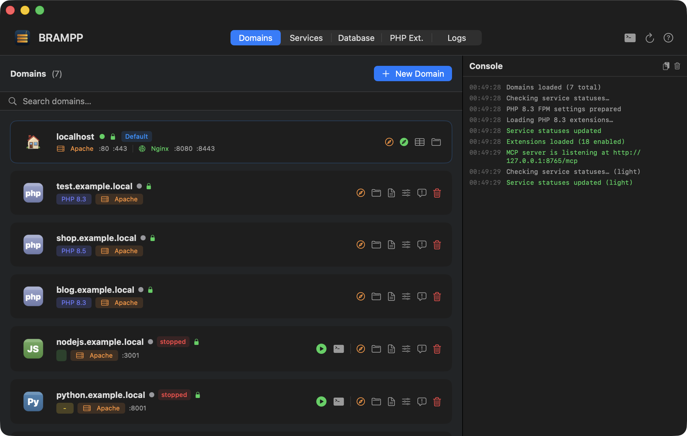
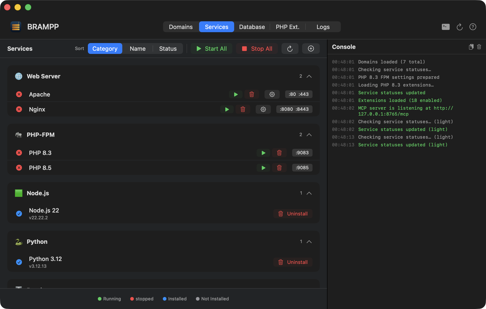
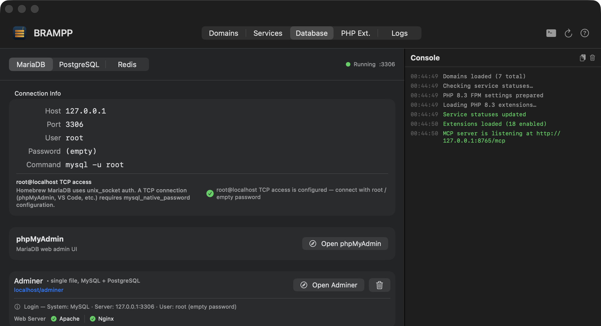
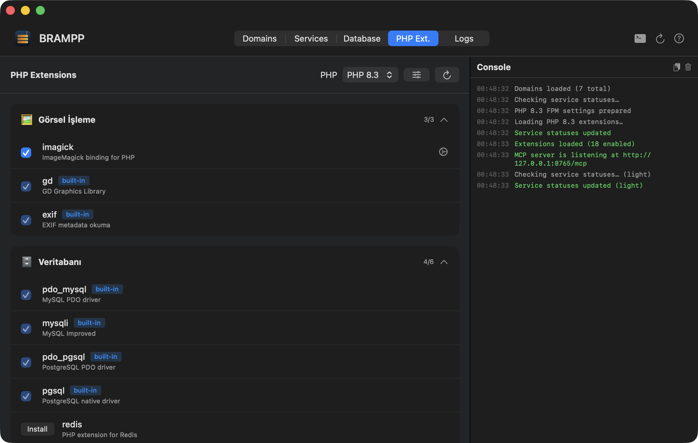
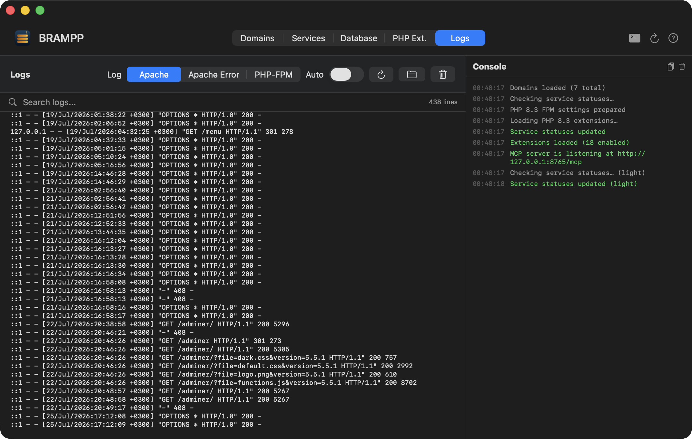
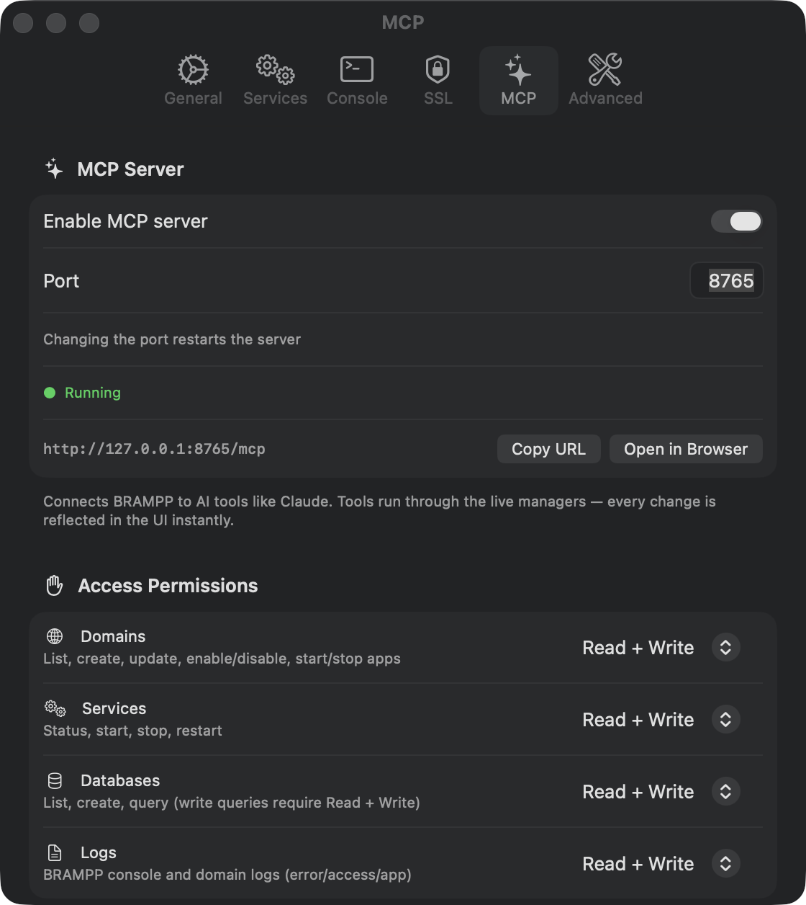

<p align="center">
  
</p>

<h1 align="center">BRAMPP</h1>

<p align="center">
  <b>The XAMPP / MAMP alternative for macOS — powered by Homebrew.</b><br>
  Manage Apache, Nginx, MariaDB/MySQL, PostgreSQL, Redis, PHP, Node.js, Python &amp; ASP.NET Core<br>
  from one native SwiftUI app. No bundled binaries, no black boxes — just your own <code>brew</code> services, tamed.
</p>

<p align="center">
  <a href="#installation"></a>
  <a href="#installation"></a>
  
  
  <a href="LICENSE"></a>
  
</p>

<p align="center">
  🇹🇷 <a href="README.tr.md">Türkçe README</a> · 🌐 <a href="https://macitkaraca.github.io/brampp/">Website</a> · 📦 <a href="../../releases/latest">Download DMG</a>
</p>

---

> **B**rew · **R**edis · **A**pache · **M**ySQL · **P**ostgreSQL · **P**HP — plus Nginx, Node.js, Python and ASP.NET Core, because acronyms have a character limit but BRAMPP doesn't.
>
> Pronounced *"bremp"* — like XAMPP after a double espresso. ☕
> Internal codename: **Demlik** 🫖 *(Turkish for teapot — where things brew properly).*

## Quick start

Four steps from a fresh Mac to a local site with a green padlock.

1. **Install** — download `BRAMPP.dmg` from [Releases](../../releases/latest) and drag **BRAMPP.app** to Applications. The app is signed with a Developer ID and notarized by Apple, so it opens straight away — no Gatekeeper prompt to work around.
2. **Run the setup wizard** — it checks Homebrew, installs the formulas you approve (`httpd`, `php`, `mariadb`…), puts Apache on port 80, wires up PHP-FPM and creates the mkcert CA. Every command it runs is printed in the console.
3. **Create your first domain** — **Domains → + New Domain**, type `myproject.local`, pick a platform (PHP / Node.js / Python / .NET / static). BRAMPP writes the vhost, adds the `/etc/hosts` entry (admin prompt), creates `~/Sites/myproject.local` and drops a sample project in it.
4. **Open `https://myproject.local`** — real certificate, real padlock, zero config files edited by hand.

Stuck on any of those? → [Troubleshooting](#troubleshooting).

## Contents

- [Why BRAMPP?](#why-brampp)
  - [What BRAMPP deliberately does *not* do](#what-brampp-deliberately-does-not-do)
- [Features](#features)
- [Screenshots — a tour of the app](#screenshots--a-tour-of-the-app)
- [Installation](#installation)
- [Using BRAMPP from AI tools (MCP)](#using-brampp-from-ai-tools-mcp)
  - [Turn the server on](#turn-the-server-on)
  - [Claude Code](#claude-code)
  - [Claude Desktop](#claude-desktop)
  - [ChatGPT Codex](#chatgpt-codex)
  - [The skill file (`mcptools`)](#the-skill-file-mcptools)
  - [One-click setup](#one-click-setup)
  - [Tools](#tools)
  - [Per-scope permissions](#per-scope-permissions)
  - [Security](#security)
  - [Example prompts](#example-prompts)
- [Troubleshooting](#troubleshooting)
- [How it works (no magic, promised)](#how-it-works-no-magic-promised)
- [FAQ](#faq)
- [Roadmap](#roadmap)
- [Contributing](#contributing)
- [License](#license)

## Why BRAMPP?

If you searched for **"XAMPP alternative for Mac"** or **"MAMP alternative macOS"**, this is it — with one key difference:

**BRAMPP doesn't ship its own server binaries.** XAMPP and MAMP install a parallel universe of Apache/PHP/MySQL that fights with everything else on your machine. BRAMPP instead manages the services you (probably) already have via [Homebrew](https://brew.sh) — the same `httpd`, `php`, `mariadb` you'd use from the terminal, now with a native GUI, automatic virtual hosts, local HTTPS and one-click databases.

| | XAMPP / MAMP | BRAMPP |
|---|---|---|
| Server binaries | Bundled, sandboxed, duplicated | Your own Homebrew services |
| Platforms served | PHP (mostly) | PHP, Node.js, Python, ASP.NET Core, static |
| Web servers | Apache | Apache **and** Nginx (even side by side) |
| Databases | MySQL | MariaDB/MySQL, PostgreSQL, Redis |
| Local HTTPS | Manual pain | Automatic via mkcert |
| `brew upgrade` friendly | 😬 | That's the whole point |
| AI assistant access | — | Built-in MCP server, 19 tools |
| End-to-end `arm64` | Varies by product and installer | The app **and** every service it manages, natively |
| Price | XAMPP free · MAMP PRO paid | Free, MIT, open source |

**And versus the Mac-native crowd:**

| | Laravel Herd | Laravel Valet | Docker stacks | BRAMPP |
|---|---|---|---|---|
| Scope | PHP-first | PHP only, terminal | Anything, in containers | PHP + Node + Python + .NET + static |
| Where services run | Bundled runtime | Your Homebrew PHP | Containers | Your Homebrew services |
| GUI | Yes (Pro features paid) | No | Third-party | Yes, free |
| Nginx **and** Apache | Nginx | Nginx | Your call | Both, per domain |
| Cost | Free tier + Pro | Free | Free | Free, MIT |

### What BRAMPP deliberately does *not* do

Being clear about the edges saves you an evening:

- **No production deployment.** It configures your Mac for local development, nothing else.
- **No bundled binaries.** If Homebrew can't install it, BRAMPP can't manage it.
- **No containers.** If your team ships `docker-compose.yml`, use Docker — BRAMPP is the "native services" answer, not a container manager.
- **No Windows or Linux.** It's a native macOS app (Apple Silicon).

## Features

- **Service control** — start/stop/restart Apache, Nginx, PHP-FPM (8.1–8.5), MariaDB, PostgreSQL (multi-version), Redis and more. Live status with port checks, crash notifications, auto-start of last-running services.
- **Local domains** — create `myproject.local` in seconds: virtual host, `/etc/hosts` entry, site folder and sample project generated automatically. Apache *or* Nginx per domain.
- **Every stack, one app** — PHP (per-domain PHP version), Node.js, Python (FastAPI/Django/Flask + venv), ASP.NET Core, static sites & SPAs (history-mode fallback included).
- **Real HTTPS locally** — one-click [mkcert](https://github.com/FiloSottile/mkcert) integration: local CA, per-domain certificates, HTTP→HTTPS redirect. The green padlock, at home.
- **Databases without the CLI** — create/drop databases, dump & restore (single-transaction for PostgreSQL), phpMyAdmin / pgAdmin / Adminer installers, `my.cnf` / `postgresql.conf` / `redis.conf` editors with safe writes.
- **PHP extension manager** — 26 curated extensions (xdebug, redis, imagick…), toggle on/off, PECL install, `php.ini` quick settings.
- **Process manager for app servers** — Node/Python/.NET apps run under a zero-dependency supervisor: auto-restart, combined logs, safe stop that never kills a process it doesn't own.
- **Setup wizard** — checks and configures Apache ports, PHP-FPM, mkcert CA, localhost SSL, MariaDB root access and phpMyAdmin. From zero to `https://localhost` without touching a config file.
- **Backups** — one click backs up domains, settings, vhosts, SSL certs and php.ini files; partial backups are detected and never silently restored.
- **MCP server for AI tools** — a built-in [Model Context Protocol](https://modelcontextprotocol.io) endpoint (127.0.0.1 only, off by default). Claude, Codex and friends get **19 tools** behind **per-scope permissions** — and every change they make appears in the BRAMPP window instantly. → [details](#using-brampp-from-ai-tools-mcp)
- **Menu bar app** — the whole stack lives in your menu bar. Turkish & English UI, live-switchable.

## Screenshots — a tour of the app

*UI shown in English. BRAMPP also speaks Turkish — the [Turkish README](README.tr.md) has the same tour with Turkish screenshots.*

### 🌐 Domains

Every local site in one list: platform badge (PHP / Node.js / Python / .NET / static), per-domain PHP version, Apache or Nginx, SSL padlock and live running state. The default `localhost` card shows both web servers' ports at a glance, and **+ New Domain** sets up vhost + `/etc/hosts` + site folder + sample project in one step.



### ⚙️ Services

The whole stack grouped by category — web servers, PHP-FPM versions, runtimes, databases, cache. Start/stop with one click, live port badges, config buttons for Apache/Nginx, and installer buttons (phpMyAdmin, pgAdmin, Adminer) right on the service row. Services you haven't installed can be hidden or installed from here.



### 🗄️ Database

MariaDB, PostgreSQL and Redis panels with copy-ready connection info. BRAMPP detects whether `root@localhost` TCP access is already configured (green check) and offers the one-click fix only when it's actually needed. Create, drop, dump and restore databases; open phpMyAdmin or Adminer without remembering a single URL.



### 🧩 PHP Extensions

26 curated extensions per PHP version — xdebug, redis, imagick and friends — with one-click enable/disable, PECL install and `php.ini` quick settings.



### 📜 Logs

Apache, Nginx, PHP-FPM and per-app logs in one place, with live tail — no `tail -f` gymnastics.



### 🤖 Settings — MCP server

Flip one switch and BRAMPP becomes an MCP endpoint for AI tools (`http://127.0.0.1:8765/mcp`, loopback only). Per-scope access permissions, a live count of how many tools are actually enabled, and one-click setup for Claude Desktop, ChatGPT Codex and the skill file. Details: [Using BRAMPP from AI tools (MCP)](#using-brampp-from-ai-tools-mcp).



## Installation

### Requirements

- macOS 14 Sonoma or newer, **Apple Silicon only** (the shipped build is `arm64`; Intel Macs are not supported)
- [Homebrew](https://brew.sh) — BRAMPP's only dependency. Don't have it? The setup wizard will help you install it.

### Option 1 — Download the DMG

1. Grab the latest `BRAMPP.dmg` from [**Releases**](../../releases/latest).
2. Drag **BRAMPP.app** to Applications.
3. Open it. The app is Developer ID signed and notarized, so macOS lets it run without any extra step.
4. Follow the setup wizard. It installs and configures only what you approve — every command it runs is shown in the console.

### Signing and notarization

Releases are signed with a **Developer ID Application** certificate and **notarized by Apple**. The notarization ticket is stapled to both the DMG and the app itself, so Gatekeeper can verify it even on a machine that is offline the first time you launch.

You can check it yourself:

```bash
spctl -a -vvv -t exec /Applications/BRAMPP.app
# accepted
# source=Notarized Developer ID
```

Building from source produces an unsigned local build instead — that is expected, and a locally built app is never quarantined.

### Option 2 — Build from source (the trust-but-verify route)

```bash
git clone https://github.com/macitkaraca/brampp.git
cd brampp
xcodebuild build -project macos/BRAMPP.xcodeproj -scheme BRAMPP -configuration Release
```

The app is 100% open source — if you're the kind of person who runs local dev servers, you're the kind of person who can read the code that manages them.

## Using BRAMPP from AI tools (MCP)

While BRAMPP is running it publishes its own [Model Context Protocol](https://modelcontextprotocol.io) endpoint at `http://127.0.0.1:8765/mcp` (Streamable HTTP, JSON-RPC 2.0 over `POST`). The tools call the app's **live managers** — the very same code paths the buttons use — so every domain your assistant creates and every service it starts appears in the BRAMPP window immediately, with no refresh.

Open that URL in a browser and you get a setup page instead of a protocol error: instructions for every client plus the full tool list. (**Settings → MCP → Open in Browser** does the same thing.)

### Turn the server on

**BRAMPP → Settings → MCP → flip the switch.** MCP has its own tab in Settings; the port is editable there (default `8765`, any value from 1024 to 65535). The server is **off by default**, never starts by itself, and stops when BRAMPP quits.

### Claude Code

Claude Code speaks Streamable HTTP directly, so a plain `.mcp.json` in your project root is enough (this repo already ships one):

```json
{
  "mcpServers": {
    "brampp": {
      "type": "http",
      "url": "http://127.0.0.1:8765/mcp"
    }
  }
}
```

### Claude Desktop

Claude Desktop's config schema accepts **only `command` (stdio) servers** — a `"type": "http"` entry is dropped silently ("Skipped invalid MCP server config entries"). It therefore needs the `mcp-remote` bridge, which runs through `npx` and so **requires Node.js**:

```json
{
  "mcpServers": {
    "brampp": {
      "command": "npx",
      "args": ["-y", "mcp-remote", "http://127.0.0.1:8765/mcp", "--allow-http"]
    }
  }
}
```

The file lives at `~/Library/Application Support/Claude/claude_desktop_config.json`; restart Claude Desktop after editing it. (BRAMPP's own one-click install writes an absolute path to `npx` plus a `PATH` entry, because Claude Desktop starts subprocesses with a minimal environment and the bridge otherwise fails to find `node`.)

### ChatGPT Codex

Codex supports Streamable HTTP **directly** — no bridge, no Node.js. Add this to `~/.codex/config.toml`:

```toml
[mcp_servers.brampp]
url = "http://127.0.0.1:8765/mcp"
```

Note the table name: `mcp_servers` (underscore), not `mcpServers`. There is **no** `transport` key — a URL is what marks the server as HTTP; `command`/`args` would make it stdio instead.

Codex has no concept of skills, so the equivalent instructions go into its global instruction file `~/.codex/AGENTS.md`. BRAMPP writes them between two markers:

```markdown
<!-- BRAMPP-MCP:START -->
…tool list, arguments and gotchas…
<!-- BRAMPP-MCP:END -->
```

Everything outside the markers is left alone, so your own AGENTS.md content survives installs, updates and removals.

### The skill file (`mcptools`)

`~/.claude/skills/mcptools/SKILL.md` is a Claude skill that documents each tool, its arguments and the gotchas (service start is asynchronous, `/etc/hosts` needs an admin prompt, the database tools need MariaDB/PostgreSQL running, a missing tool usually means a permission is off). With it in place Claude reaches for the right tool instead of guessing at shell commands.

It's installed globally, so it works in every project — not just this one.

### One-click setup

**Settings → MCP → Claude Integration** does all of the above for you, with three rows:

| Row | What the button writes | Removal |
|---|---|---|
| **Claude Desktop** | the `mcp-remote` entry in `claude_desktop_config.json` | removes just the `brampp` key |
| **ChatGPT Codex** | `[mcp_servers.brampp]` in `~/.codex/config.toml` | removes just that table |
| **Claude Skill** | `~/.claude/skills/mcptools/SKILL.md` + the marked section in `~/.codex/AGENTS.md` | removes both |

Before **every** write the existing file is copied to `<file>.bak-YYYYMMDD-HHmmss`, and the app tells you the backup's name with a **Reveal Backup** button next to it. Only BRAMPP's own entry is touched — your other MCP servers, preferences, comments and key order stay exactly as they were. Claude Desktop needs a restart afterwards; Claude Code and Codex pick the change up on the next session.

### Tools

19 tools, grouped by the scope that governs them:

**Domains**

| Tool | What it does | Access |
| --- | --- | --- |
| `list_domains` | Lists every registered domain (platform, web server, port, enabled/running, SSL, URL) | read |
| `create_domain` | Creates a domain: site folder, vhost, SSL certificate and `/etc/hosts` entry | write |
| `update_domain` | Changes an existing domain — PHP version, port, SSL, web server, document root, service dependencies. Only the fields you pass change; the vhost is regenerated | write |
| `set_domain_enabled` | Enables/disables a domain — the record and files stay, only vhost + hosts entry are removed/regenerated | write |
| `health_check` | Sends a real HTTP request to the domain to see whether the site actually answers (end-to-end, not just "the service is running") | read |
| `start_app` | Starts the background app of a Node.js/Python/.NET domain (dependency install and `start.sh` included) | write |
| `stop_app` | Stops that app | write |
| `app_status` | Run state of the app: running or not, PIDs, command, CPU, memory | read |

**Services**

| Tool | What it does | Access |
| --- | --- | --- |
| `service_status` | Status of every service (id, name, state, port, version) | read |
| `start_service` | Starts a brew service (`httpd`, `nginx`, `mariadb`, `php@8.3`, `redis`…) | write |
| `stop_service` | Stops a brew service | write |
| `restart_service` | Restarts a service to apply a config change (expect a short outage) | write |

**Databases**

| Tool | What it does | Access |
| --- | --- | --- |
| `db_list` | Lists MariaDB/MySQL or PostgreSQL databases | read |
| `db_create` | Creates a database (leaves an existing one alone) | write |
| `db_query` | Runs a single SQL statement. Read-only by default (SELECT/SHOW/DESCRIBE/EXPLAIN/WITH); anything that modifies data needs `allow_write: true` **and** write permission | read (write with `allow_write`) |
| `db_export` | Dumps a database to `.sql` (`mysqldump --single-transaction --routines --triggers` / `pg_dump`). Writes to `~/Library/Application Support/BRAMPP/backups` when no path is given; a failed dump deletes the partial file | write |
| `db_import` | Applies a `.sql` dump to a target database, creating it if missing | write |

**Logs**

| Tool | What it does | Access |
| --- | --- | --- |
| `read_log` | Last lines of the BRAMPP console (default 50, max 500) | read |
| `read_domain_log` | A domain's error/access log, or the app log for Node.js/Python/.NET domains (default 100 lines, max 1000) | read |

### Per-scope permissions

**Settings → MCP → Access Permissions** sets each scope — **Domains, Services, Databases, Logs** — to one of **No access / Read / Read + write**. The screen shows a live count of the tools that are currently callable, so you can see the effect of a change immediately.

A tool that is not permitted **never shows up in the client at all**: `tools/list` is filtered, and a call attempted anyway is refused with an explanation (list filtering is not the only defense — a client that hardcoded a tool name still gets a "no" and a pointer to this screen). Set Domains to *Read* and Claude can list your sites but cannot create or disable one; set Databases to *No access* and the database tools simply do not exist as far as the assistant is concerned. So if your assistant says a tool isn't available, this screen is the first place to look.

### Security

- Binds to **127.0.0.1 only** — never to a public interface.
- `Origin` and `Host` headers are validated, so a random web page in your browser can't reach the endpoint (DNS rebinding included).
- Anything that writes to `/etc/hosts` still goes through the app's normal **administrator (sudo) prompt** — the endpoint has no privileges of its own.
- The server is **off by default** and stops when BRAMPP quits.

### Example prompts

> "Create a PHP 8.5 domain called `blog.local` in BRAMPP"

> "Show me the last 50 lines of the error log for `shop.example.local`"

> "Start MariaDB, create a `shop` database and list the tables in it"

> "`api.local` returns 502 — check whether the app is running and read its log"

## Troubleshooting

<details>
<summary><b>"BRAMPP.app cannot be opened because Apple could not verify it"</b></summary>

Release builds are notarized, so this should not happen. If it does, the DMG was probably modified in transit — re-download it from [Releases](../../releases/latest). See [Signing and notarization](#signing-and-notarization).
</details>

<details>
<summary><b>Homebrew isn't installed</b></summary>

The setup wizard detects it and offers to install it — but the Homebrew installer needs an interactive `sudo`, so BRAMPP opens **Terminal** and runs the official script there:

```bash
/bin/bash -c "$(curl -fsSL https://raw.githubusercontent.com/Homebrew/install/HEAD/install.sh)"
```

When Terminal is done, come back to the wizard and press **Recheck**. Nothing installs behind your back, and nothing is bundled — BRAMPP simply won't run any brew command until brew exists.
</details>

<details>
<summary><b>Apache won't start / port 80 is in use</b></summary>

Apache logs `Address already in use` when something else already owns port 80 — often macOS's own `httpd`, a Docker container, or Nginx that BRAMPP itself started. Find the culprit:

```bash
sudo lsof -nP -iTCP:80 -sTCP:LISTEN
```

Then either stop that process, or move BRAMPP off port 80: **Services → Apache (or Nginx) → config button → HTTP port**. Apache and Nginx can happily run side by side as long as they don't both want 80.

Two other honest possibilities: a leftover `Listen 8080` line in `httpd.conf` (the wizard normalizes duplicate `Listen` lines to a single `Listen 80`), or a broken config — BRAMPP runs `apachectl configtest` / `nginx -t` after every write and rolls back syntax errors, but a file you edited by hand outside the app is on you.
</details>

<details>
<summary><b>The admin (password) prompt when creating a domain</b></summary>

Only `/etc/hosts` needs root — that's the file that maps `myproject.local` to `127.0.0.1`. BRAMPP asks per operation (Touch ID works), shows the command first, and never keeps a privileged helper running in the background.

If you cancel the prompt, the domain is **still created** — vhost, folder, certificate, all of it — it just won't resolve in the browser. Two ways out:

- add the line yourself: `127.0.0.1  myproject.local`
- or let the app do it: when entries are missing, an orange repair banner appears above the Domains tab; **Repair** re-adds all of them in one prompt.
</details>

<details>
<summary><b>Claude / Codex can't see BRAMPP</b></summary>

Walk down this list, in order:

1. **Is the server on?** BRAMPP must be running *and* **Settings → MCP** switched on. It's off by default. Quick check: `curl -s -o /dev/null -w '%{http_code}' http://127.0.0.1:8765/mcp` — `405` means it's alive (it wants `POST`), no answer at all means it isn't.
2. **Right port?** If you changed the port, the client config has to change too.
3. **Tools missing rather than the server?** That's [permissions](#per-scope-permissions), not a bug: a scope set to *No access* removes its tools from `tools/list` entirely.
4. **Claude Desktop specifically:** it needs the `mcp-remote` bridge (so Node.js), and a **full restart** — quitting the window isn't enough. If the config was edited by hand, check that the entry didn't get dropped as invalid: a `"type": "http"` entry is silently ignored there.
5. **Codex specifically:** the table must be `[mcp_servers.brampp]` with a `url` key. No `transport` key, no `command`.
6. **Still nothing?** **Settings → MCP → Open in Browser** loads the built-in setup page straight from the running server — if that page opens, the server is fine and the problem is on the client side.
</details>

## How it works (no magic, promised)

- Services are managed with `brew services run` — session-scoped, nothing autostarts at login unless you ask.
- Virtual hosts are plain Apache/Nginx config files in `vhosts/` and `sites-available/` — readable, editable, yours.
- `/etc/hosts` changes ask for admin rights *per operation* and the exact command is shown before it runs.
- Config edits are transactional: BRAMPP validates with `apachectl configtest` / `nginx -t` *after every write* and rolls back anything that breaks syntax.
- App data lives in `~/Library/Application Support/BRAMPP/`, sites default to `~/Sites/` — delete the former and BRAMPP forgets you ever met.

## FAQ

**Is this a XAMPP replacement?**
For macOS, yes — that's the design goal. It covers the XAMPP/MAMP workflow (Apache + PHP + MySQL + phpMyAdmin) and adds Nginx, PostgreSQL, Redis, Node.js, Python and ASP.NET Core on top.

**Does it conflict with my existing Homebrew setup?**
No — it *is* your Homebrew setup. BRAMPP reads and manages the formulas you already have; it never installs a parallel copy.

**Is the app signed and notarized?**
Yes. Releases carry a Developer ID Application signature and an Apple notarization ticket, stapled to both the DMG and the app. Verify with `spctl -a -vvv -t exec /Applications/BRAMPP.app` — it should report `source=Notarized Developer ID`. You can still audit the code and build it yourself.

**Why do some things ask for my password?**
Only `/etc/hosts` edits (adding `127.0.0.1 myproject.local`) require admin rights. Everything else runs as your user.

**Is the MCP server safe to leave on?**
It listens on loopback only, validates `Origin`/`Host`, holds no privileges of its own and can be narrowed per scope — but it is still a door into your dev environment. It's off by default on purpose; turn it on when you're using it.

**Turkish? English?**
Both — switchable at runtime in Settings. The app was born in Turkish (say *merhaba* to codename Demlik 🫖) and speaks fluent English.

## Roadmap

- [ ] Homebrew Cask (`brew install --cask brampp`)
- [ ] Laravel / WordPress project presets
- [ ] Xdebug one-click profiles
- [ ] Per-domain environment variables and `.env` support
- [ ] More MCP tools (backup/restore, PHP extensions)

No dates promised. This is a project built in the evenings, and the roadmap is a wishlist, not a contract.

## Contributing

Issues and PRs welcome.

- **Bug reports:** the **Logs** tab probably saw it first — attach its output, plus your macOS version and `brew --version`. Screenshots of the failing screen help more than a paragraph describing it.
- **Pull requests:** open the Xcode project at `macos/BRAMPP.xcodeproj`; new `.swift` files inside the app folder are picked up automatically. Code comments in the codebase are Turkish, UI strings go through the `Localizer` catalog in both languages — add both, or the app falls back to the key.
- **Feature ideas:** open an issue first. "It manages Homebrew services" is the line the project tries not to cross; "it becomes its own package manager" is not on the menu.

## License

[MIT](LICENSE) © 2023–2026 Karaca Teknoloji

---

<p align="center">
  Built by <b><a href="https://github.com/macitkaraca">Macit Karaca</a></b>
  at <b><a href="https://karacatechnology.com">Karaca Technology</a></b><br>
  <sub>MIT licensed · © 2023–2026 Karaca Teknoloji (Macit Karaca)</sub>
</p>

<p align="center"><sub>
Keywords, for the search engines among us: XAMPP alternative macOS · MAMP alternative · local development environment Mac ·
Homebrew GUI · Apache Nginx manager · MariaDB PostgreSQL Redis GUI · PHP Node.js Python ASP.NET local server · mkcert HTTPS localhost · valet alternative · MCP server macOS
</sub></p>
