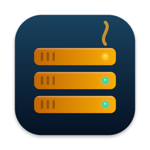
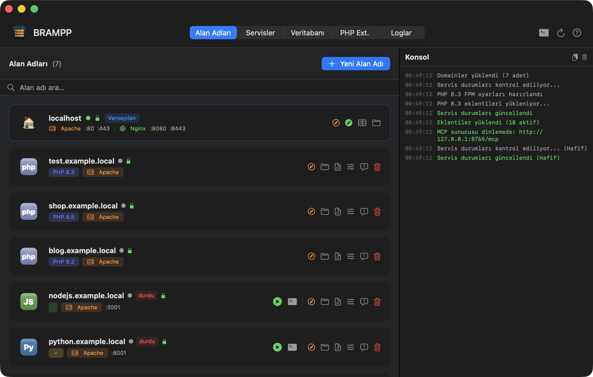
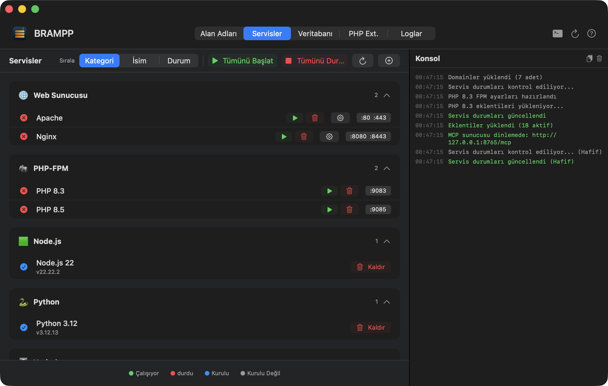
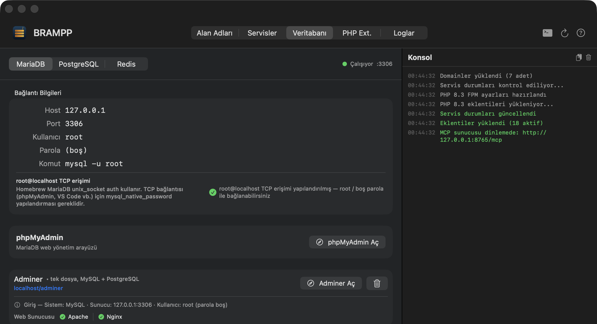
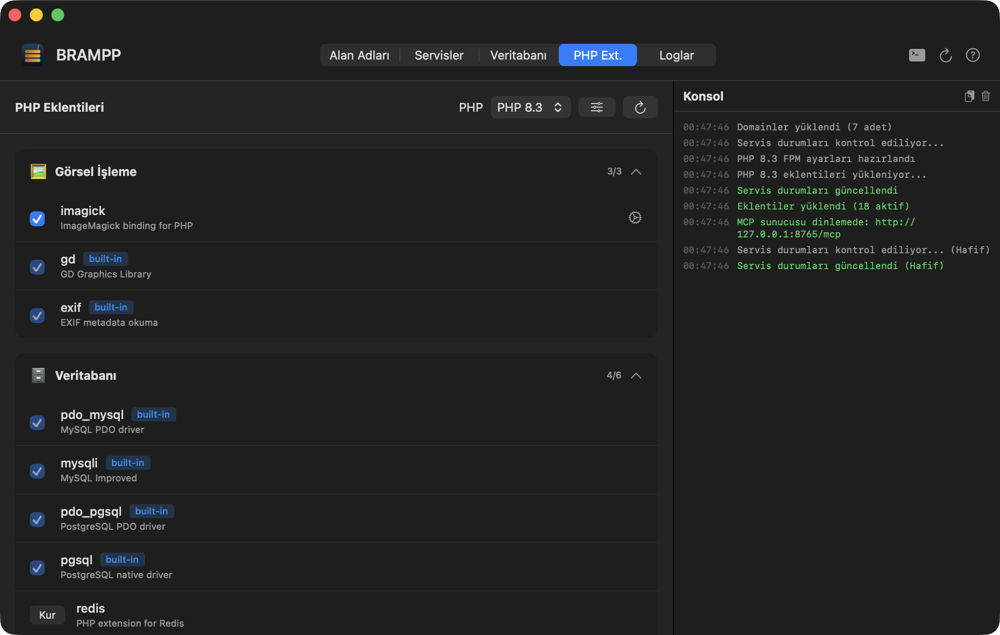
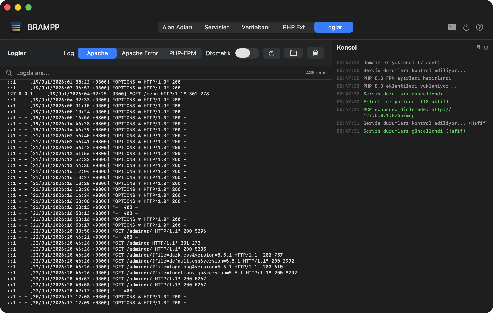
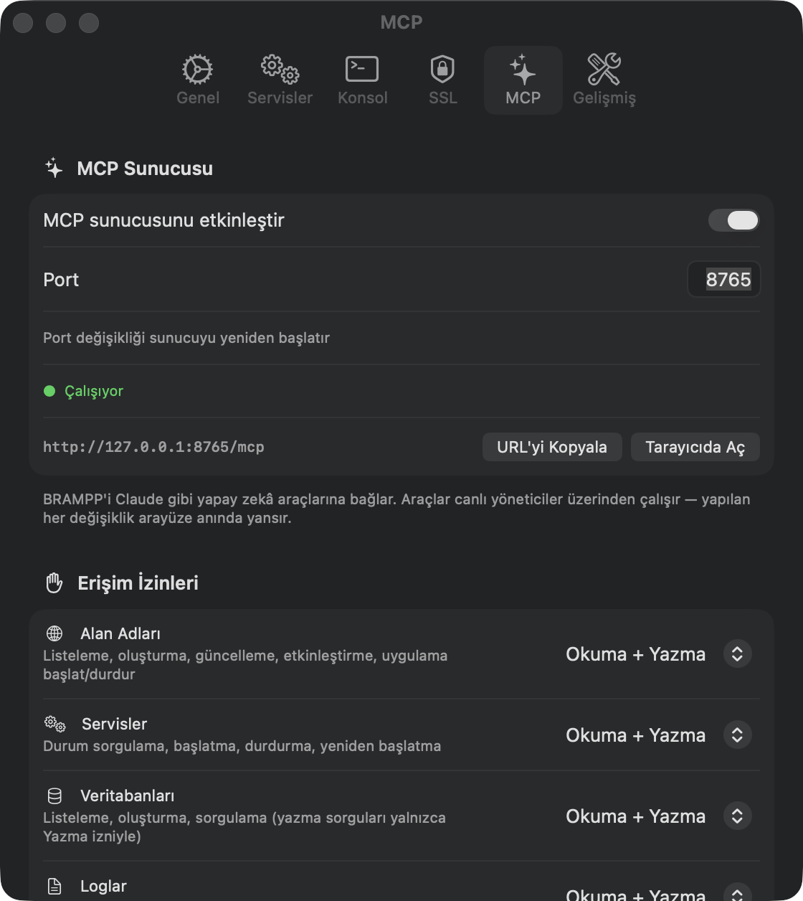

<p align="center">
  
</p>

<h1 align="center">BRAMPP</h1>

<p align="center">
  <b>macOS için XAMPP / MAMP alternatifi — Homebrew gücüyle.</b><br>
  Apache, Nginx, MariaDB/MySQL, PostgreSQL, Redis, PHP, Node.js, Python ve ASP.NET Core'u<br>
  tek bir native SwiftUI uygulamasından yönetin. Gömülü ikili yok, kara kutu yok — yalnızca kendi <code>brew</code> servisleriniz, ehlileştirilmiş hâliyle.
</p>

<p align="center">
  <a href="#kurulum"></a>
  <a href="#kurulum"></a>
  
  
  <a href="LICENSE"></a>
  
</p>

<p align="center">
  🇬🇧 <a href="README.md">English README</a> · 🌐 <a href="https://macitkaraca.github.io/brampp/">Web Sitesi</a> · 📦 <a href="../../releases/latest">DMG İndir</a>
</p>

---

> **B**rew · **R**edis · **A**pache · **M**ySQL · **P**ostgreSQL · **P**HP — artı Nginx, Node.js, Python ve ASP.NET Core; çünkü kısaltmaların karakter sınırı var, BRAMPP'in yok.
>
> Okunuşu *"bremp"* — duble espresso içmiş XAMPP gibi. ☕
> Dahili kod adı: **Demlik** 🫖

## Hızlı Başlangıç

Sıfırdan yeşil kilitli bir yerel siteye dört adım.

1. **Kurun** — [Releases](../../releases/latest) sayfasından `BRAMPP.dmg` indirin ve **BRAMPP.app**'i Applications klasörüne sürükleyin. Uygulama Developer ID ile imzalı ve Apple tarafından noter onaylı olduğundan doğrudan açılır — aşmanız gereken bir Gatekeeper adımı yok.
2. **Kurulum sihirbazını çalıştırın** — Homebrew'u kontrol eder, onayladığınız formülleri kurar (`httpd`, `php`, `mariadb`…), Apache'yi 80 portuna alır, PHP-FPM'i bağlar ve mkcert CA'sını oluşturur. Çalıştırdığı her komut konsolda görünür.
3. **İlk alan adınızı oluşturun** — **Alan Adları → + Yeni Alan Adı**, `projem.test` yazın, platformu seçin (PHP / Node.js / Python / .NET / statik). BRAMPP vhost'u yazar, `/etc/hosts` girişini ekler (yönetici onayı), `~/Sites/projem.test` klasörünü açar ve içine örnek bir proje bırakır.
4. **`https://projem.test` adresini açın** — gerçek sertifika, gerçek kilit, elle düzenlenen sıfır config dosyası.

Adımlardan birinde takıldınız mı? → [Sorun Giderme](#sorun-giderme).

## İçindekiler

- [Neden BRAMPP?](#neden-brampp)
  - [BRAMPP'in bilerek *yapmadıkları*](#yapmadiklari)
- [Özellikler](#özellikler)
- [Ekran Görüntüleri — uygulama turu](#ekran-görüntüleri--uygulama-turu)
- [Kurulum](#kurulum)
- [BRAMPP'i yapay zekâ araçlarından kullanmak (MCP)](#bramppi-yapay-zekâ-araçlarından-kullanmak-mcp)
  - [Sunucuyu açın](#sunucuyu-açın)
  - [Claude Code](#claude-code)
  - [Claude Desktop](#claude-desktop)
  - [ChatGPT Codex](#chatgpt-codex)
  - [Beceri dosyası (`mcptools`)](#beceri-dosyası-mcptools)
  - [Tek tıkla kurulum](#tek-tıkla-kurulum)
  - [Araçlar](#araçlar)
  - [Alan bazlı izinler](#alan-bazlı-izinler)
  - [Güvenlik](#güvenlik)
  - [Örnek istemler](#örnek-istemler)
- [Sorun Giderme](#sorun-giderme)
- [Nasıl çalışır? (sihir yok, söz)](#nasıl-çalışır-sihir-yok-söz)
- [SSS](#sss)
- [Yol Haritası](#yol-haritası)
- [Katkı](#katkı)
- [Lisans](#lisans)

## Neden BRAMPP?

XAMPP ve MAMP kendi Apache/PHP/MySQL kopyalarını kurar ve makinenizdeki her şeyle çatışır. BRAMPP ise **kendi ikili dosyalarını taşımaz** — zaten kullandığınız [Homebrew](https://brew.sh) servislerini yönetir: aynı `httpd`, aynı `php`, aynı `mariadb`; ama artık native bir arayüz, otomatik virtual host, yerel HTTPS ve tek tıkla veritabanı yönetimiyle.

| | XAMPP / MAMP | BRAMPP |
|---|---|---|
| Sunucu ikilileri | Gömülü, izole, mükerrer | Kendi Homebrew servisleriniz |
| Desteklenen platformlar | Çoğunlukla PHP | PHP, Node.js, Python, ASP.NET Core, statik |
| Web sunucuları | Apache | Apache **ve** Nginx (aynı anda bile) |
| Veritabanları | MySQL | MariaDB/MySQL, PostgreSQL, Redis |
| Yerel HTTPS | Elle, zahmetli | mkcert ile otomatik |
| `brew upgrade` uyumu | 😬 | Zaten bütün mesele bu |
| Yapay zekâ erişimi | — | Yerleşik MCP sunucusu, 23 araç |
| Uçtan uca `arm64` | Ürüne ve kuruluma göre değişir | Uygulama **ve** yönettiği tüm servisler, native |
| Fiyat | XAMPP ücretsiz · MAMP PRO ücretli | Ücretsiz, MIT, açık kaynak |

**Peki macOS'a özgü diğer araçlara karşı:**

| | Laravel Herd | Laravel Valet | Docker yığınları | BRAMPP |
|---|---|---|---|---|
| Kapsam | Önce PHP | Yalnızca PHP, terminal | Her şey, konteynerde | PHP + Node + Python + .NET + statik |
| Servisler nerede çalışır | Gömülü çalışma zamanı | Kendi Homebrew PHP'niz | Konteyner | Kendi Homebrew servisleriniz |
| Arayüz | Var (Pro özellikleri ücretli) | Yok | Üçüncü parti | Var, ücretsiz |
| Nginx **ve** Apache | Nginx | Nginx | Size kalmış | İkisi de, alan adı başına |
| Ücret | Ücretsiz katman + Pro | Ücretsiz | Ücretsiz | Ücretsiz, MIT |

<a id="yapmadiklari"></a>

### BRAMPP'in bilerek *yapmadıkları*

Sınırları baştan bilmek bir akşamınızı kurtarır:

- **Yayına (production) dağıtım yok.** Mac'inizi yerel geliştirme için yapılandırır, başka bir şey için değil.
- **Gömülü ikili yok.** Homebrew kuramıyorsa BRAMPP de yönetemez.
- **Konteyner yok.** Ekibiniz `docker-compose.yml` ile çalışıyorsa Docker kullanın — BRAMPP "native servisler" cevabıdır, konteyner yöneticisi değil.
- **Windows/Linux yok.** Native bir macOS uygulaması (Apple Silicon).

## Özellikler

- **Servis kontrolü** — Apache, Nginx, PHP-FPM (8.1–8.5), MariaDB, PostgreSQL (çoklu sürüm), Redis: başlat/durdur/yeniden başlat, canlı port kontrolü, çökme bildirimi, son çalışanları açılışta başlatma.
- **Yerel alan adları** — `projem.test` saniyeler içinde: vhost + `/etc/hosts` kaydı + site klasörü + örnek proje. Alan adı başına Apache **veya** Nginx.
- **Her stack** — PHP (alan adı başına sürüm), Node.js, Python (FastAPI/Django/Flask + venv), ASP.NET Core, statik site & SPA (history-mode fallback dahil).
- **Yerel HTTPS** — tek tıkla [mkcert](https://github.com/FiloSottile/mkcert): yerel CA, alan adı başına sertifika, HTTP→HTTPS yönlendirme. Yeşil kilit, evinizde.
- **Veritabanı yönetimi** — oluştur/sil, yedekle/geri yükle (PostgreSQL'de tek transaction), phpMyAdmin / Adminer kurulumu, `my.cnf` / `postgresql.conf` / `redis.conf` panelleri (güvenli yazma ile).
- **PHP eklenti yöneticisi** — 26 seçilmiş eklenti (xdebug, redis, imagick…), aç/kapat, PECL kurulumu, `php.ini` hızlı ayarları.
- **Uygulama süreç yöneticisi** — Node/Python/.NET uygulamaları sıfır bağımlılıklı bir süpervizörle: otomatik yeniden başlatma, birleşik loglar, sahibi olmadığı süreci ASLA öldürmeyen güvenli durdurma.
- **Kurulum sihirbazı** — Apache portları, PHP-FPM, mkcert CA, localhost SSL, MariaDB root erişimi ve phpMyAdmin'i adım adım yapılandırır. Tek bir config dosyasına dokunmadan `https://localhost`.
- **Yedekleme** — alan adları, ayarlar, vhost'lar, SSL sertifikaları ve php.ini'ler tek tıkla; eksik yedek asla sessizce geri yüklenmez.
- **PHP profilleyici** — Xdebug'ın profil kipini `php.ini` elle düzenlenmeden yönetir, cachegrind çıktılarını tek klasörde toplar ve listeler. Siz istemedikçe yalnızca `XDEBUG_TRIGGER` taşıyan istekler ölçülür.
- **Siteyi geçici olarak paylaşın** — tek tıkla Cloudflare Quick Tunnel açılır ve herkese açık bir `trycloudflare.com` adresi döner; müşteriye göstermek ya da telefondan açmak için. Cloudflare hesabı gerekmez; BRAMPP kapanınca tüneller kapanır.
- **Yapay zekâ araçları için MCP sunucusu** — yerleşik [Model Context Protocol](https://modelcontextprotocol.io) uç noktası (yalnızca 127.0.0.1, varsayılan kapalı). Claude, Codex ve arkadaşları **alan bazlı izinlerin** arkasındaki **23 araca** erişir; yaptıkları her değişiklik BRAMPP penceresine anında yansır. → [ayrıntılar](#bramppi-yapay-zekâ-araçlarından-kullanmak-mcp)
- **Menü çubuğu** — tüm stack menü çubuğunuzda. Türkçe & İngilizce arayüz, çalışırken değiştirilebilir.

## Ekran Görüntüleri — uygulama turu

*Görseller Türkçe arayüzden. İngilizce tur için: [English README](README.md).*

### 🌐 Alan Adları

Tüm yerel siteleriniz tek listede: platform rozeti (PHP / Node.js / Python / .NET / statik), alan adı başına PHP sürümü, Apache veya Nginx, SSL kilidi ve canlı çalışma durumu. Varsayılan `localhost` kartı iki web sunucusunun portlarını tek bakışta gösterir; **+ Yeni Alan Adı** ise vhost + `/etc/hosts` + site klasörü + örnek projeyi tek adımda kurar.



### ⚙️ Servisler

Tüm stack kategorilere ayrılmış: web sunucuları, PHP-FPM sürümleri, çalışma zamanları, veritabanları, önbellek. Tek tıkla başlat/durdur, canlı port rozetleri, Apache/Nginx ayar düğmeleri ve servis satırında kurulum düğmeleri (phpMyAdmin, Adminer). Kurulu olmayan servisler gizlenebilir ya da buradan kurulabilir.



### 🗄️ Veritabanı

MariaDB, PostgreSQL ve Redis panelleri, kopyalamaya hazır bağlantı bilgileriyle. BRAMPP `root@localhost` TCP erişiminin zaten yapılandırılıp yapılandırılmadığını algılar (yeşil onay) ve tek tık düzeltmeyi yalnızca gerçekten gerektiğinde önerir. Veritabanı oluştur, sil, yedekle, geri yükle; phpMyAdmin veya Adminer'i URL ezberlemeden aç.



### 🧩 PHP Eklentileri

PHP sürümü başına 26 seçilmiş eklenti — xdebug, redis, imagick ve arkadaşları — tek tıkla aç/kapat, PECL kurulumu ve `php.ini` hızlı ayarları.



### 📜 Loglar

Apache, Nginx, PHP-FPM ve uygulama logları tek yerde, canlı takip ile — `tail -f` cambazlığına gerek yok.



### 🤖 Ayarlar — MCP sunucusu

Tek bir anahtar açın, BRAMPP yapay zekâ araçları için bir MCP uç noktasına dönüşsün (`http://127.0.0.1:8765/mcp`, yalnızca loopback). Alan bazlı erişim izinleri, gerçekten kaç aracın etkin olduğunu gösteren canlı sayaç ve Claude Desktop, ChatGPT Codex ile beceri dosyası için tek tıkla kurulum. Ayrıntılar: [BRAMPP'i yapay zekâ araçlarından kullanmak (MCP)](#bramppi-yapay-zekâ-araçlarından-kullanmak-mcp).



## Kurulum

### Gereksinimler

- macOS 14 Sonoma veya üstü, **yalnızca Apple Silicon** (dağıtılan sürüm `arm64`; Intel Mac'ler desteklenmez)
- [Homebrew](https://brew.sh) — BRAMPP'in tek bağımlılığı. Kurulu değilse sihirbaz kurmanıza yardım eder.

### Seçenek 1 — DMG indirin

1. [**Releases**](../../releases/latest) sayfasından `BRAMPP.dmg` indirin.
2. **BRAMPP.app**'i Applications'a sürükleyin.
3. Açın. Uygulama Developer ID imzalı ve noter onaylı olduğu için macOS ek bir adım istemeden çalıştırır.
4. Kurulum sihirbazını izleyin — yalnızca onayladığınızı kurar; çalıştırdığı her komut konsolda görünür.

<a id="imzalama-noter-onayi"></a>

### İmzalama ve noter onayı

Yayınlanan sürümler **Developer ID Application** sertifikasıyla imzalanır ve **Apple tarafından noter onayından** geçer. Noter bileti hem DMG'ye hem uygulamanın kendisine zımbalanır; böylece ilk açılışta internetiniz olmasa bile Gatekeeper doğrulamayı yerelde yapabilir.

Kendiniz de doğrulayabilirsiniz:

```bash
spctl -a -vvv -t exec /Applications/BRAMPP.app
# accepted
# source=Notarized Developer ID
```

Kaynaktan derlerseniz imzasız yerel bir derleme elde edersiniz — bu beklenen durumdur ve yerelde derlenen uygulama karantinaya alınmaz.

### Seçenek 2 — Kaynaktan derleyin (güven ama doğrula yolu)

```bash
git clone https://github.com/macitkaraca/brampp.git
cd brampp
xcodebuild build -project macos/BRAMPP.xcodeproj -scheme BRAMPP -configuration Release
```

Uygulama %100 açık kaynak — yerel sunucu çalıştıran biriyseniz, onları yöneten kodu da okuyabilirsiniz.

## BRAMPP'i yapay zekâ araçlarından kullanmak (MCP)

BRAMPP çalışırken kendi [Model Context Protocol](https://modelcontextprotocol.io) uç noktasını `http://127.0.0.1:8765/mcp` adresinde yayınlar (Streamable HTTP, `POST` üzerinden JSON-RPC 2.0). Araçlar uygulamanın **canlı yöneticilerini** çağırır — düğmelerin kullandığı kodun ta kendisini — yani asistanın oluşturduğu her alan adı, başlattığı her servis BRAMPP penceresinde anında görünür; yenilemeye gerek yok.

Bu adresi tarayıcıda açarsanız protokol hatası yerine bir kurulum sayfası gelir: her istemci için yönergeler ve araçların tam listesi. (**Ayarlar → MCP → Tarayıcıda Aç** düğmesi de aynı sayfayı açar.)

### Sunucuyu açın

**BRAMPP → Ayarlar → MCP → anahtarı açın.** MCP'nin Ayarlar'da kendi sekmesi var; port aynı ekrandan değiştirilebilir (varsayılan `8765`, izin verilen aralık 1024–65535). Sunucu **varsayılan olarak kapalıdır**, kendiliğinden başlamaz ve BRAMPP kapanınca durur.

### Claude Code

Claude Code Streamable HTTP'yi doğrudan konuşur; proje kökünde düz bir `.mcp.json` yeterlidir (bu depoda zaten var):

```json
{
  "mcpServers": {
    "brampp": {
      "type": "http",
      "url": "http://127.0.0.1:8765/mcp"
    }
  }
}
```

### Claude Desktop

Claude Desktop'ın yapılandırma şeması **yalnızca `command` (stdio) tipi sunucu kabul eder** — `"type": "http"` girişi sessizce elenir ("Skipped invalid MCP server config entries"). Bu yüzden `mcp-remote` köprüsü gerekir; köprü `npx` ile çalıştığından **Node.js kurulu olmalıdır**:

```json
{
  "mcpServers": {
    "brampp": {
      "command": "npx",
      "args": ["-y", "mcp-remote", "http://127.0.0.1:8765/mcp", "--allow-http"]
    }
  }
}
```

Dosyanın yeri: `~/Library/Application Support/Claude/claude_desktop_config.json`. Düzenledikten sonra Claude Desktop'ı yeniden başlatın. (BRAMPP'in tek tıklık kurulumu `npx`in tam yolunu ve bir `PATH` girdisini de yazar: Claude Desktop alt süreçleri asgari bir ortamla başlatır, aksi hâlde köprü `node` ikilisini bulamayıp sessizce çöker.)

### ChatGPT Codex

Codex, Streamable HTTP'yi **doğrudan** destekler — köprü yok, Node.js gerekmez. `~/.codex/config.toml` dosyasına şunu ekleyin:

```toml
[mcp_servers.brampp]
url = "http://127.0.0.1:8765/mcp"
```

Tablo adına dikkat: `mcp_servers` (alt çizgili), `mcpServers` değil. **`transport` diye bir anahtar yoktur** — sunucuyu HTTP yapan şey `url` anahtarının kendisidir; `command`/`args` yazarsanız stdio sunucusu olur.

Codex'te beceri (skill) kavramı bulunmadığından aynı yönergeler genel talimat dosyası `~/.codex/AGENTS.md` içine yazılır. BRAMPP bunu iki işaretçi arasına koyar:

```markdown
<!-- BRAMPP-MCP:START -->
…araç listesi, argümanlar ve tuzaklar…
<!-- BRAMPP-MCP:END -->
```

İşaretçilerin dışında kalan her şeye dokunulmaz; kendi AGENTS.md içeriğiniz kurulumdan, güncellemeden ve kaldırmadan sağ çıkar.

### Beceri dosyası (`mcptools`)

`~/.claude/skills/mcptools/SKILL.md`, her aracı, argümanlarını ve tuzaklarını (servis başlatmanın eşzamansız olması, `/etc/hosts` için yönetici onayı, veritabanı araçlarından önce MariaDB/PostgreSQL'in çalışıyor olması gerektiği, eksik görünen bir aracın çoğu zaman kapalı bir izin olması) anlatan bir Claude becerisidir. Yerinde olduğunda Claude kabuk komutu tahmin etmek yerine doğru aracı seçer.

Beceri genel (global) kurulur; yalnızca bu projede değil, her projede geçerlidir.

### Tek tıkla kurulum

**Ayarlar → MCP → Claude Entegrasyonu** yukarıdakilerin hepsini sizin yerinize yapar; üç satır vardır:

| Satır | Düğme neyi yazar | Kaldırma |
|---|---|---|
| **Claude Desktop** | `claude_desktop_config.json` içine `mcp-remote` girişi | yalnızca `brampp` anahtarını siler |
| **ChatGPT Codex** | `~/.codex/config.toml` içine `[mcp_servers.brampp]` | yalnızca o tabloyu siler |
| **Claude Becerisi** | `~/.claude/skills/mcptools/SKILL.md` + `~/.codex/AGENTS.md` içindeki işaretli bölüm | ikisini de kaldırır |

**Her** yazma işleminden önce mevcut dosya `<dosya>.bak-YYYYAAGG-SSddss` biçiminde kopyalanır; uygulama yedeğin adını gösterir ve yanına **Yedeği Göster** düğmesi koyar. Yalnızca BRAMPP'in kendi girişine dokunulur — diğer MCP sunucularınız, tercihleriniz, yorum satırlarınız ve anahtar sıranız aynen kalır. Claude Desktop'ın sonrasında yeniden başlatılması gerekir; Claude Code ve Codex değişikliği bir sonraki oturumda görür.

### Araçlar

23 araç, bağlı oldukları erişim alanına göre gruplanmış hâlde:

**Alan Adları**

| Araç | Ne yapar | Erişim |
| --- | --- | --- |
| `list_domains` | Kayıtlı tüm alan adlarını listeler (platform, web sunucusu, port, etkin/çalışıyor, SSL, URL) | okuma |
| `create_domain` | Yeni alan adı oluşturur: site klasörü, vhost, SSL sertifikası ve `/etc/hosts` girişi | yazma |
| `update_domain` | Var olan alan adını değiştirir — PHP sürümü, port, SSL, web sunucusu, site klasörü, servis bağımlılıkları. Yalnızca verdiğiniz alanlar değişir; vhost yeniden üretilir | yazma |
| `set_domain_enabled` | Alan adını etkinleştirir/devre dışı bırakır — kayıt ve dosyalar korunur, yalnızca vhost + hosts girişi kaldırılır/yeniden üretilir | yazma |
| `health_check` | Alan adına gerçek bir HTTP isteği atarak sitenin yanıt verip vermediğini doğrular (yalnızca "servis çalışıyor" değil, uçtan uca test) | okuma |
| `start_app` | Node.js/Python/.NET alan adının arka plan uygulamasını başlatır (bağımlılık kurulumu ve `start.sh` dahil) | yazma |
| `stop_app` | Bu uygulamayı durdurur | yazma |
| `app_status` | Uygulamanın çalışma bilgisi: çalışıyor mu, PID'ler, komut, CPU, bellek | okuma |

**Servisler**

| Araç | Ne yapar | Erişim |
| --- | --- | --- |
| `service_status` | Tüm servislerin durumu (id, ad, durum, port, sürüm) | okuma |
| `start_service` | Bir brew servisini başlatır (`httpd`, `nginx`, `mariadb`, `php@8.3`, `redis`…) | yazma |
| `stop_service` | Bir brew servisini durdurur | yazma |
| `install_service` | BRAMPP kataloğundaki bir servisi Homebrew ile kurar. Katalog dışı formül adı reddedilir | yazma |
| `restart_service` | Yapılandırma değişikliğini uygulamak için servisi yeniden başlatır (kısa bir kesinti olur) | yazma |

**Veritabanları**

| Araç | Ne yapar | Erişim |
| --- | --- | --- |
| `db_list` | MariaDB/MySQL veya PostgreSQL veritabanlarını listeler | okuma |
| `db_create` | Veritabanı oluşturur (zaten varsa dokunmaz) | yazma |
| `db_query` | Tek bir SQL ifadesi çalıştırır. Varsayılanı salt okuma (SELECT/SHOW/DESCRIBE/EXPLAIN/WITH); veri değiştiren ifadeler için hem `allow_write: true` hem de yazma izni gerekir | okuma (`allow_write` ile yazma) |
| `db_export` | Veritabanının `.sql` dökümünü alır (`mysqldump --single-transaction --routines --triggers` / `pg_dump`). Yol verilmezse `~/Library/Application Support/BRAMPP/backups` altına yazar; başarısız dökümde yarım dosyayı siler | yazma |
| `db_import` | Bir `.sql` dökümünü hedef veritabanına uygular; hedef yoksa oluşturur | yazma |

**Loglar**

| Araç | Ne yapar | Erişim |
| --- | --- | --- |
| `read_log` | BRAMPP konsolundaki satırlar; `level`, `search` ve `since_minutes` ile süzülür. `source: "file"` canlı tampon yerine diskteki günlük dosyayı okur — son ~300 satırdan eskisini görmenin tek yolu | okuma |
| `read_domain_log` | Bir alan adının error/access logu ya da Node.js/Python/.NET alan adlarında uygulama logu (varsayılan 100 satır, en çok 1000) | okuma |

**Paylaşım**

| Araç | Ne yapar | Erişim |
| --- | --- | --- |
| `list_shares` | Şu anda açık olan Cloudflare tünellerini ve herkese açık adreslerini listeler | okuma |
| `start_share` | Bir alan adı için Cloudflare Quick Tunnel açar ve **herkese açık** bir `trycloudflare.com` adresi döndürür | yazma |
| `stop_share` | Tüneli kapatır; herkese açık adres anında ölür | yazma |

Varsayılanı **erişim yok** olan tek alan paylaşımdır. Bu araçlar yalnızca sizin
makinenizden erişilebilen bir siteyi açık internete çıkarır — üstelik tünelin kendisinde
parola yoktur — bu yüzden kapalı gelir, siz açarsınız.

### Alan bazlı izinler

**Ayarlar → MCP → Erişim İzinleri** ekranında her alan — **Alan Adları, Servisler, Veritabanları, Loglar** — **İzin yok / Okuma / Okuma + Yazma** olarak ayarlanır. Ekran, o an gerçekten çağrılabilen araç sayısını canlı gösterir; değişikliğin etkisini anında görürsünüz.

İzin verilmeyen bir araç istemcide **hiç görünmez**: `tools/list` süzülür, yine de çağrılırsa istek gerekçesiyle birlikte reddedilir (liste süzmesi tek savunma değildir: araç adını sabit yazmış bir istemci de "hayır" yanıtını ve bu ekrana yönlendirmeyi alır). Alan Adları'nı *Okuma* yaparsanız Claude sitelerinizi listeler ama yeni alan adı oluşturamaz veya kapatamaz; Veritabanları'nı *İzin yok* yaparsanız veritabanı araçları asistan için hiç var olmaz. Asistanınız bir aracın bulunmadığını söylüyorsa ilk bakılacak yer burasıdır.

### Güvenlik

- Yalnızca **127.0.0.1** üzerinde dinler — asla dışa açık bir arayüzde değil.
- `Origin` ve `Host` başlıkları doğrulanır; tarayıcınızdaki rastgele bir web sayfası uç noktaya ulaşamaz (DNS rebinding dahil).
- `/etc/hosts` dosyasına yazan her işlem yine uygulamanın olağan **yönetici (sudo) onayından** geçer — uç noktanın kendine ait bir yetkisi yoktur.
- Sunucu **varsayılan olarak kapalıdır** ve BRAMPP kapanınca durur.

### Örnek istemler

> "BRAMPP'te `blog.test` adında PHP 8.5 alan adı oluştur"

> "`shop.example.test`'in hata logunun son 50 satırını göster"

> "MariaDB'yi başlat, `shop` veritabanını oluştur ve içindeki tabloları listele"

> "`api.test` 502 dönüyor — uygulama çalışıyor mu bak ve logunu oku"

## Sorun Giderme

<details>
<summary><b>"BRAMPP.app açılamıyor çünkü Apple doğrulayamadı"</b></summary>

Yayın sürümleri noter onaylıdır, yani bunu görmemeniz gerekir. Yine de olduysa DMG aktarım sırasında bozulmuş olabilir — [Releases](../../releases/latest) sayfasından yeniden indirin. Bkz. [İmzalama ve noter onayı](#imzalama-noter-onayi).
</details>

<details>
<summary><b>Homebrew kurulu değil</b></summary>

Sihirbaz bunu algılar ve kurmayı önerir — ama Homebrew kurucusu etkileşimli `sudo` istediğinden BRAMPP **Terminal**'i açıp resmî betiği orada çalıştırır:

```bash
/bin/bash -c "$(curl -fsSL https://raw.githubusercontent.com/Homebrew/install/HEAD/install.sh)"
```

Terminal işini bitirince sihirbaza dönüp **Yeniden Kontrol Et** düğmesine basın. Arkanızdan hiçbir şey kurulmaz, gömülü hiçbir ikili yoktur — brew yoksa BRAMPP hiçbir brew komutu çalıştırmaz.
</details>

<details>
<summary><b>Apache başlamıyor / 80 portu dolu</b></summary>

80 portunu başka bir şey tutuyorsa Apache `Address already in use` yazar — çoğu zaman macOS'un kendi `httpd`'si, bir Docker konteyneri ya da yine BRAMPP'in başlattığı Nginx. Suçluyu bulun:

```bash
sudo lsof -nP -iTCP:80 -sTCP:LISTEN
```

Sonra ya o süreci durdurun ya da BRAMPP'i 80'den çekin: **Servisler → Apache (veya Nginx) → ayar düğmesi → HTTP portu**. Apache ve Nginx, ikisi birden 80'i istemediği sürece yan yana gayet mutlu çalışır.

İki dürüst ihtimal daha: `httpd.conf` içinde artakalmış bir `Listen 8080` satırı (sihirbaz mükerrer `Listen` satırlarını tek bir `Listen 80`e indirger) ya da bozuk bir config — BRAMPP her yazımdan sonra `apachectl configtest` / `nginx -t` çalıştırıp sözdizimi hatasını geri alır, ama uygulamanın dışında elle düzenlediğiniz dosya size kalmış.
</details>

<details>
<summary><b>Alan adı oluştururken çıkan yönetici (şifre) istemi</b></summary>

Yalnızca `/etc/hosts` root ister — `projem.test` adını `127.0.0.1`e bağlayan dosya odur. BRAMPP izni işlem başına sorar, çalıştırılacak komutu önce gösterir ve arka planda yetkili bir yardımcı süreç tutmaz.

İstemi iptal ederseniz alan adı **yine de oluşur** — vhost, klasör, sertifika, hepsi — sadece tarayıcıda çözümlenmez. İki çıkış yolu:

- satırı kendiniz ekleyin: `127.0.0.1  projem.test`
- ya da uygulamaya bırakın: girişler eksikken Alan Adları sekmesinin üstünde turuncu bir onarım şeridi çıkar; **Onar** hepsini tek istemde geri ekler.
</details>

<details>
<summary><b>Claude / Codex BRAMPP'i göremiyor</b></summary>

Sırayla şu listeyi inin:

1. **Sunucu açık mı?** BRAMPP çalışıyor *ve* **Ayarlar → MCP** anahtarı açık olmalı; varsayılan kapalıdır. Hızlı kontrol: `curl -s -o /dev/null -w '%{http_code}' http://127.0.0.1:8765/mcp` — `405` "ayakta" demektir (`POST` bekliyor), hiç yanıt yoksa kapalıdır.
2. **Port doğru mu?** Portu değiştirdiyseniz istemci yapılandırmasını da değiştirmeniz gerekir.
3. **Sunucu değil de araçlar mı eksik?** Bu bir hata değil, [izindir](#alan-bazlı-izinler): *İzin yok* yapılan bir alanın araçları `tools/list` yanıtından tamamen çıkar.
4. **Özellikle Claude Desktop:** `mcp-remote` köprüsü (dolayısıyla Node.js) ve **tam bir yeniden başlatma** gerekir — pencereyi kapatmak yetmez. Yapılandırmayı elle düzenlediyseniz girişin geçersiz diye elenmediğinden emin olun: oraya yazılan `"type": "http"` girişi sessizce yok sayılır.
5. **Özellikle Codex:** tablo `[mcp_servers.brampp]` olmalı ve içinde `url` bulunmalı. `transport` anahtarı yok, `command` yok.
6. **Hâlâ yoksa:** **Ayarlar → MCP → Tarayıcıda Aç** sayfayı doğrudan çalışan sunucudan yükler — sayfa açılıyorsa sunucu sağlamdır, sorun istemci tarafındadır.
</details>

## Nasıl çalışır? (sihir yok, söz)

- Servisler `brew services run` ile yönetilir — oturum kapsamlı, izniniz olmadan hiçbir şey girişte başlamaz.
- Virtual host'lar `vhosts/` ve `sites-available/` içinde düz Apache/Nginx config dosyalarıdır — okunabilir, düzenlenebilir, sizindir.
- `/etc/hosts` değişiklikleri işlem başına yönetici izni ister ve çalıştırılacak komut önceden gösterilir.
- Config yazımları doğrulamalıdır: her yazımdan sonra `apachectl configtest` / `nginx -t` çalışır, sözdizimini bozan değişiklik geri alınır.
- Uygulama verisi `~/Library/Application Support/BRAMPP/` altında, siteler varsayılan olarak `~/Sites/` içinde durur — ilkini silin, BRAMPP sizi hiç tanımamış olur.

## SSS

**Bu bir XAMPP yerine geçer mi?**
macOS için evet, tasarım hedefi bu. XAMPP/MAMP akışını (Apache + PHP + MySQL + phpMyAdmin) kapsar, üstüne Nginx, PostgreSQL, Redis, Node.js, Python ve ASP.NET Core ekler.

**Mevcut Homebrew kurulumumla çakışır mı?**
Hayır — o kurulumun *kendisi* zaten. BRAMPP hâlihazırdaki formüllerinizi okur ve yönetir; paralel bir kopya kurmaz.

**Uygulama imzalı ve noter onaylı mı?**
Evet. Yayın sürümleri Developer ID Application imzası ve Apple noter bileti taşır; bilet hem DMG'ye hem uygulamaya zımbalıdır. `spctl -a -vvv -t exec /Applications/BRAMPP.app` komutu `source=Notarized Developer ID` demeli. Kodu yine de inceleyip kendiniz derleyebilirsiniz.

**Neden bazı işlemler şifre soruyor?**
Yalnızca `/etc/hosts` düzenlemeleri (`127.0.0.1 projem.test` satırı) yönetici hakkı ister. Geri kalan her şey sizin kullanıcınızla çalışır.

**MCP sunucusunu açık bırakmak güvenli mi?**
Yalnızca loopback dinler, `Origin`/`Host` doğrular, kendine ait bir yetkisi yoktur ve alan bazında kısılabilir — ama yine de geliştirme ortamınıza açılan bir kapıdır. Varsayılan olarak kapalı olması tesadüf değil: kullanacağınız zaman açın.

**Türkçe mi, İngilizce mi?**
İkisi de — Ayarlar'dan çalışırken değiştirilebilir. Uygulama Türkçe doğdu (kod adı Demlik 🫖) ve akıcı İngilizce konuşuyor.

## Yol Haritası

- [ ] Homebrew Cask (`brew install --cask brampp`)
- [ ] Laravel / WordPress proje şablonları
- [ ] Tek tıkla Xdebug profilleri
- [ ] Alan adı başına ortam değişkenleri ve `.env` desteği
- [ ] Daha fazla MCP aracı (yedekleme/geri yükleme, PHP eklentileri)

Tarih sözü yok. Bu proje akşamları yazılıyor; yol haritası bir sözleşme değil, dilek listesi.

## Katkı

Issue ve PR'lar açıktır.

- **Hata bildirimi:** olayı büyük ihtimalle önce **Loglar** sekmesi gördü — çıktısını, macOS sürümünüzü ve `brew --version` sonucunu ekleyin. Hatalı ekranın görüntüsü, onu anlatan bir paragraftan daha çok işe yarar.
- **Pull request:** `macos/BRAMPP.xcodeproj` dosyasını Xcode'da açın; uygulama klasörüne eklenen yeni `.swift` dosyaları otomatik derlenir. Kod yorumları Türkçedir, arayüz metinleri `Localizer` kataloğundan geçer — iki dili birden ekleyin, yoksa uygulama anahtarın kendisini gösterir.
- **Özellik fikri:** önce bir issue açın. Projenin geçmemeye çalıştığı çizgi şu: "Homebrew servislerini yönetir". "Kendi paket yöneticisi olur" menüde yok.

## Platformlar

BRAMPP bugün macOS için var. Windows ve Linux tasarım aşamasında — geliştirilmiyor.
Her birinin önce vermesi gereken kararlar [`windows/README.md`](windows/README.md) ve
[`linux/README.md`](linux/README.md) dosyalarında.

Üçü arasında paylaşılan kod yok. Onları bir arada tutan şey [`spec/`](spec/) altında
yazılı: [MCP araç sözleşmesi](spec/mcp-tools.md) ve
[güncelleme manifesti](spec/update-manifest.md). Bir yapı, bunları uyguladığında BRAMPP'tır.

## Güvenlik

Bir açık mı buldunuz? [SECURITY.tr.md](SECURITY.tr.md) — herkese açık issue yerine özel bildirin.

## Katkı

Depo düzeni, derleme ve test, ve bir şeye dokunmadan önce bilmeye değer tuzaklar: [CONTRIBUTING.tr.md](CONTRIBUTING.tr.md).

## Lisans

[MIT](LICENSE) © 2023–2026 Karaca Teknoloji

---

<p align="center">
  <b><a href="https://github.com/macitkaraca">Macit Karaca</a></b> tarafından
  <b><a href="https://karacatechnology.com">Karaca Teknoloji</a></b> bünyesinde geliştirildi<br>
  <sub>MIT lisanslı · © 2023–2026 Karaca Teknoloji (Macit Karaca)</sub>
</p>

<p align="center"><sub>
Arama motorları için anahtar kelimeler: macOS XAMPP alternatifi · MAMP alternatifi · Mac yerel geliştirme ortamı ·
Homebrew arayüzü · Apache Nginx yöneticisi · MariaDB PostgreSQL Redis arayüzü · PHP Node.js Python ASP.NET yerel sunucu · mkcert HTTPS localhost · valet alternatifi · macOS MCP sunucusu
</sub></p>
